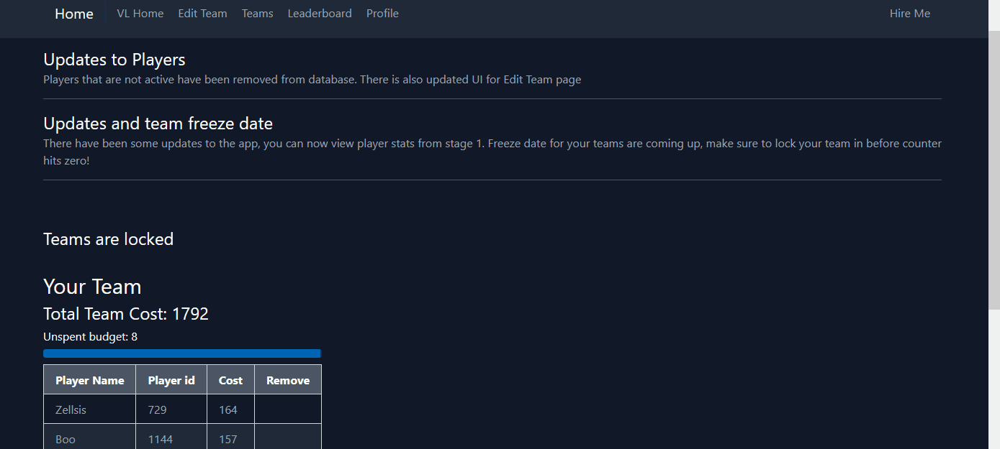
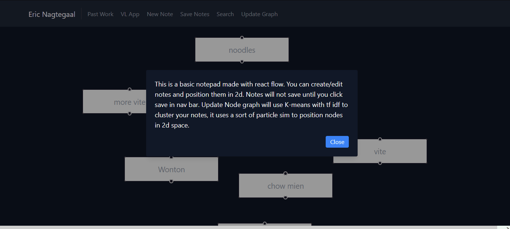

# About
This is my personal website showcasing my software development projects and technical expertise. The site features an about page and hosts interactive web applications including a Valorant Fantasy League platform and a spatial notepad app with AI-powered note clustering.

Built to demonstrate full-stack development capabilities across various technologies and domains.

## Valorant Fantasy League

A full-stack fantasy sports platform for Valorant esports, featuring dynamic player valuations and competitive tournament simulation.
### Features

- **Smart Player Valuation**: ELO rating algorithm using historical data to calculate dynamic player values
- **Tournament Management**: Swiss-stage and double-elimination playoff systems with real-time updates
- **Secure Authentication**: Auth0 integration for user management
- **Live Platform**: Deployed and accessible at [ericnagtegaal.ca/vl](https://ericnagtegaal.ca/vl)

### Tech Stack

- **Frontend**: React.js
- **Backend**: Node.js with PM2 process management
- **Database**: SQLite
- **Authentication**: Auth0
- **Hosting**: Linode

## Notepad App

A spatial note-taking application that allows users to create, organize, and visualize notes in an infinite 2D workspace with intelligent auto-grouping capabilities.

### Features

- **2D Spatial Interface**: Drag and drop notes freely in an infinite canvas using React Flow
- **Full CRUD Operations**: Create, read, update, and delete notes with persistent storage
- **Advanced Search**: Quickly find notes across your entire workspace
- **Intelligent Auto-Grouping**: Automatically cluster related notes using:
  - TF-IDF (Term Frequency-Inverse Document Frequency) for content analysis
  - MiniLM run in browser with WASM for better context sensitive embeddings 
  - K-means clustering for enhanced semantic note grouping
  - Particle simulation for natural spatial arrangement
- **Secure Authentication**: Auth0 integration for user management and data privacy

### Tech Stack
- **Frontend**: React.js with React Flow
- **Backend**: Node.js with PM2 process management
- **Authentication**: Auth0
- **ML/Clustering**: TF-IDF, K-means, custom particle simulation

### TODO

- [x] Implement LLM embeddings for enhanced semantic note grouping
- [ ] Implement table of contents showing headers in notepad

## Available Scripts

### `npm run dev`
Starts app on localhost

### `npm run build`
Builds to dist
